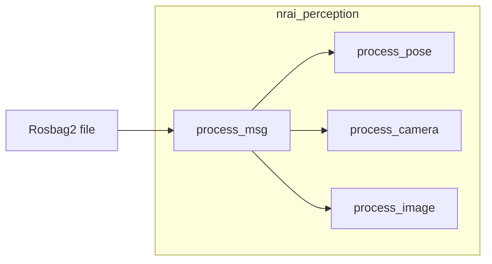

# NRAI perception

Newcastle Racing AI module for perception

To start working on this project, clone this repository.

```bash
git clone --recurse-submodules https://github.com/NewcastleRacingAI/nrai_perception.git
cd nrai_perception
```

## Project structure

```bash
nrai_perception
├── resource
│   └── nrai_perception # File marking the ros package name
├── src
│   └── nrai_perception
│       ├── ros.py      # Ros node 
│       ├── ...         # Main code
│       └── __init__.py
├── test                # Tests
├── package.xml         # Ros2 package configuration
├── setup.cfg           # Ros2 python paths
└── setup.py            # Python configuration
```

- **To add python dependencies** add them to the `setup.py` file
- **To add ros2 depedencies** add them to the `package.xml` file

## Setup (standalone)

Despite being part of the **nrai** collection of packages created by the Newcastle Racing AI group, this package can also be used in standalone mode, which **does not** require a ROS installation.

### Install the python package

As a preliminary optional step, consider creating a virtual envirnoment with any tool you commonly use

```bash
python3 -m venv .venv
source .venv/bin/activate # On Linux
.venv/script/activate # On Windows
```

Then, use pip to install the package locally in edit mode (`-e`)

```
pip3 install -e .[standalone]
```

> [!NOTE]  
> If you are having issues during the installation, consider removing the `-e` flag, or adding the `--user` flag.

All changes you make to the package will be effective immediately, without the need of reinstalling it (provided you are using the `-e` flag).

### Use

When in standalone mode, the package provides a specialized entrypoint

```bash
python3 -m nrai_perception <path to rosbag>
```

The entrypoint expects a [rosbag2](https://github.com/ros2/rosbag2) file.
In simple terms, a recording of the messages exchanged by the topics in a ROS network.

#### List of topics

If no other arguments are provided, the entrypoint will list all the topics in the rosbag

```bash
python3 -m nrai_perception <path to rosbag>
```

#### List of messages in a topic

To list all the messages in a specific topic, use the `--list-messages` argument

```bash
python3 -m nrai_perception <path to rosbag> --topic <topic name> 
```

Note that this operation may take a while if the rosbag is large, and the output may be very long.

#### Playback the rosbag

To playback the rosbag, use the `--play` argument

```bash
python3 -m nrai_perception <path to rosbag> --play
```

All the messages in the rosbag will be processed in order and sent through the `process_msg` function in the `nrai_perception.__main__` file.
The function will then filter only the topics it is interested in, and call the appropriate processing functions from the `nrai_perception.code` module.
Then, it is up to you to modify those functions to implement your own perception algorithms.


